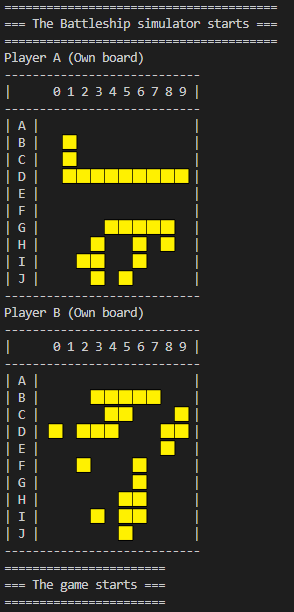
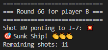
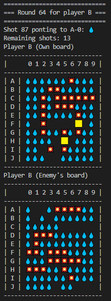
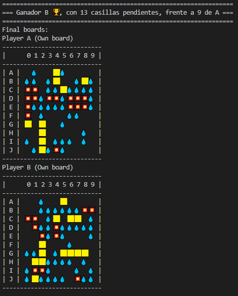

# PracticaJavaScript

Práctica JavaScript FullStackWeb KeepCoding

* Alumno: Xavi Roca Vilalta
* eMail: xroca@vilamatica.com
* Fecha: 17JAN23

# Enfoque general

He optado por una implementación de los tableros como arrays unidimensionales. La relación entre elementos del array y la tabla 10 x 10 es: 

    fila = indice div 10 (división entera)
    columna = indice mod 10 (resto)

Este diseño me simplifica el recorrido por los tableros. De cara a la visualización cambio las filas por letras con el método `String.fromCharCode( 65 + indice )`.

## Clase funcional: Board

Esta clase contiene la información de un tablero. La instancio 4 veces: 2 tableros por jugador, y los almaceno en un array (boards):

    boards[0] --> Tablero propio del player A
    boards[1] --> Tablero del enemigo del player A
    boards[2] --> Tablero propio player B
    boards[3] --> Tablero del enemigo del player B

### El constructor informa las siguientes variables:

* **player** --> Jugador (A o B)
* **own** --> `true`cuando se trata del tablero propio
* **squares[]** --> las 100 casillas. Las casillas pueden ser: NADA, AGUA, TOCADO, BARCO. No se distingue entre tocado y hundido.
* **ships[]** --> información de la distribución de barcos por las casillas. Este array es necesario para identificar si se trata del mismo barco y poder identificar los hundidos. Se podeia haber utilizado únicamente el array **squares[]**, pero la fuincionalidad de determinar si el barco estaba hundido la implementé después de que la lógica general funcionara. No quise tomar riesgos, ni complicar el diseño.
* **conEstrategia** --> `true`: este jugador aplicará estrategia al juego, almacenando el contorno de los tocados. El el código entregado hemos fijado que el Player B jueega con estrategia, mientras que el A no.
* **estrategia[]** --> Casillas de contorno de un tocado
* **torpedos** --> Número de disparos pendientes, inicalmente = MAXDISPAROS
* **turno** --> Para almacenar el número de tirnos jugados, o rondas.

### Se dispone de los siguiemtes métodos:
* **paint** --> Para dibujar el tablero
* **colocarBarco** --> Para colocar los barcos al empezar el juego. Aquí está la función random que evita repetir tableros.
* **proposeShot** --> Propone un disparo aleatorio
* **numCasillasVivas** --> Devuelve el número de casillas de barco todavía sin tocar. 

## Otras estructuras de datos
* `const MAXDISPAROS = 50` --> Número máximo de disparos por jugador.
* `turnoActual, onBoard, enemyBoard`--> Para el bucle principal del juego
* `const numBarcos = [0,3,3,2,1,1]` --> Para la configuración de la flota

# Permitido / NO permitido

## Colocación barcos
* Los barcos pueden estar pegados, no se respeta espacio entre ellos
* La posición de la flota es distinta en cada ejecución gracias a la funcion random en la colocación de los barcos
* Los barcos no se solapan nunca
* Los barcos no están en diagonal, sólo vertical u horizontal
* Los barcos no se dividen
* Se van colocando primero los más grandes y al final los más pequeños, aunque al permitir solapamiento no es un problema hacerlo al revés.

## Desarrollo del juego
* La selección de casillas para disparar es aleatoria. Unicamente se registran las casillas adyacentes a los disparos con éxito si el jugador tiene activado el fjag `conEstrategia`.
* No se seleccionan casilals directas del tablero del oponente
* No se repiten disparos
* Las transiciones de casillas són:
  * Vacio --> agua
  * Barco --> tocado
  * No registramos el estado "hundido" salvo el aviso en el momento en que hemos tocado todas las casillas de un barco

## Inteligencia
* Se puede parametrizar el hechho de jugar con inteligencia o sin ella. Con inteligencia almacenamos las casillas adyacentes al último disparo con éxito, y dispararemos sobre ellas en los siguientes turnos.

## Directrices generales
* Internamente trabajamos con índice lineal 0..99, pero lo representamos como filas 'A'..'J' y columnas '0'..'9'.
* Usamos console.log para imprimir el tablero, en una iteración de 10 filas
* No mostramos los barcos de los jugadores, sólo casillas de barco
* He utilizado únicamente código visto en clase a excepción de:
  * String.fromCharCode (para pasar de '0' a 'A' ...)
  * array.shift (recuperar y eliminar primer elemento del array)
  * array.push (añadir un elemento al array)

## Requisitos del programa mínimo
* El programa está compuesto únicamente por el fichero `index.js`
* Se informa que empieza el juego

* Las casillas pueden ser:
~~~
const NADA = '  '
const AGUA = '💧'
const TOCADO = '💥'
const BARCO = '🟨'
~~~
* Se inicia mostrando los tableros de ambos jugadores (visto antes)
* El programa informa que empiezan las rondas
* Para cada turno se muestra el turno del jugador

* Igualmente, para cada disparo se muestra la casilla, el resultado del disparo, los disparos que le quedan al jugador, y los tableros propio y del enemigo.

* Al acabar la partida se muestra el ganador, con los tableros de ambos

## Requisitos opcionales
* Se muestran todas las posibilidades de ganar, recontando en todos los casos el número de "casillas vivas" de cada jugador.
* Si hay empate se informa como tal

